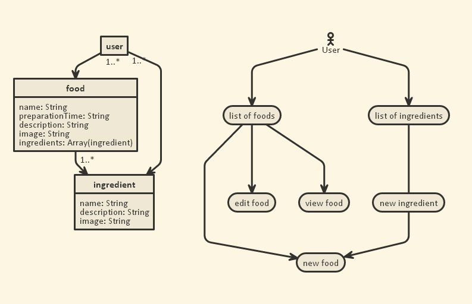
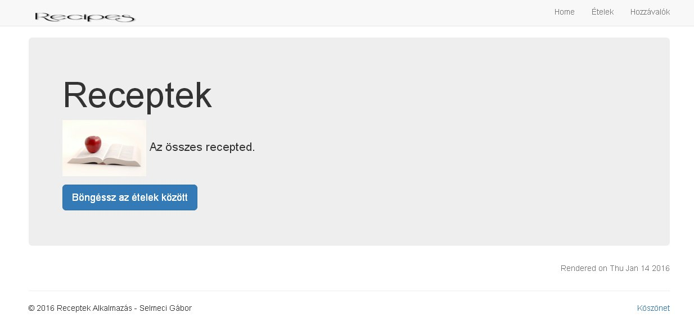
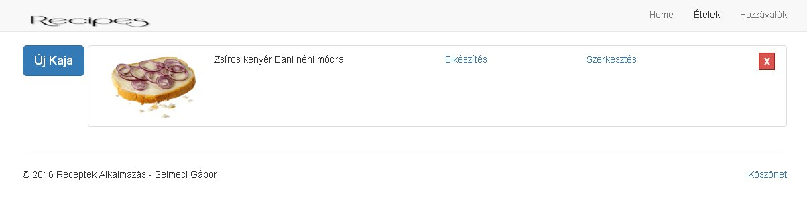
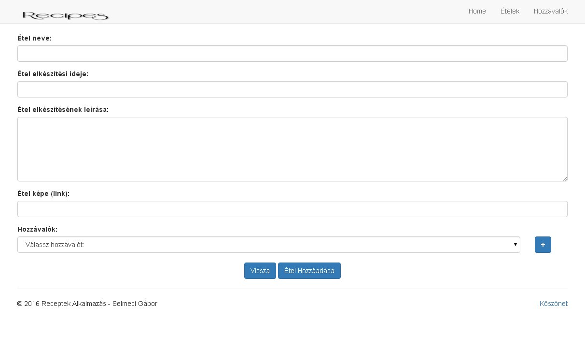
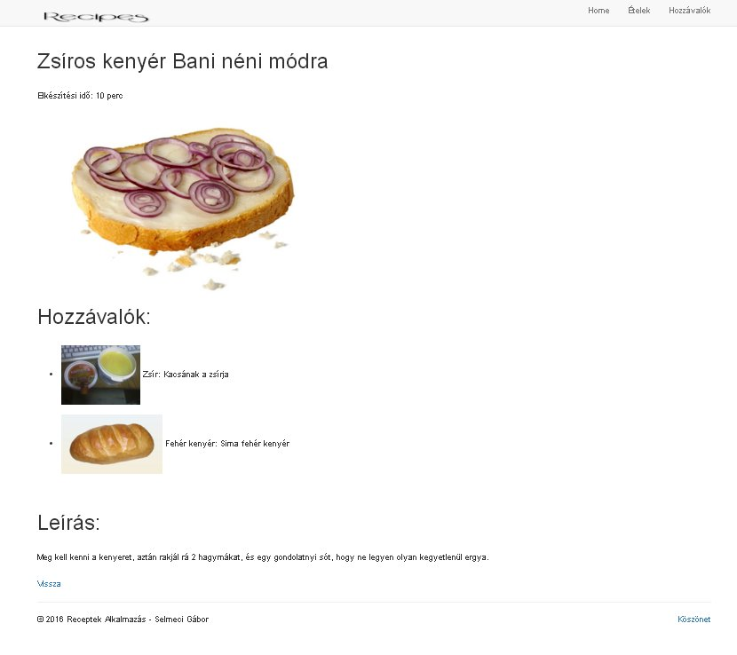
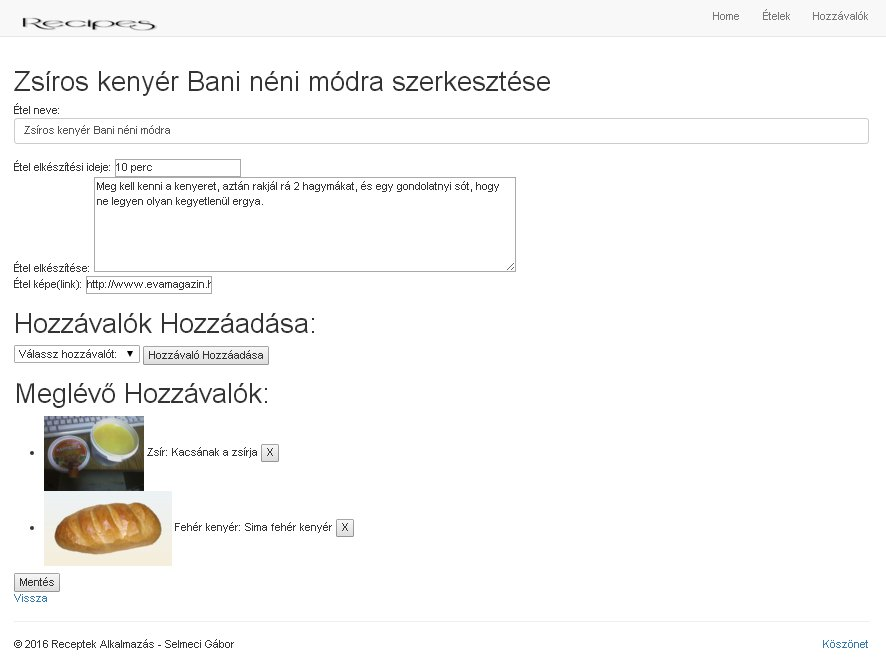
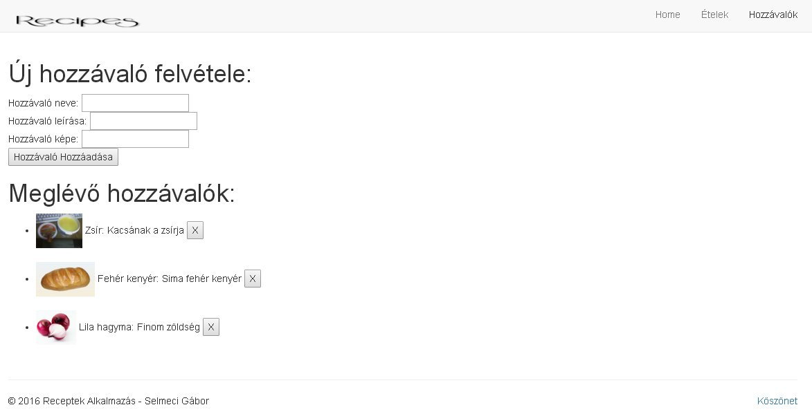
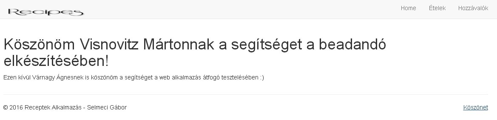

# Receptek

This README outlines the details of collaborating on this Ember application.
A short introduction of this app could easily go here.

## Prerequisites

You will need the following things properly installed on your computer.

* [Git](http://git-scm.com/)
* [Node.js](http://nodejs.org/) (with NPM)
* [Bower](http://bower.io/)
* [Ember CLI](http://www.ember-cli.com/)
* [PhantomJS](http://phantomjs.org/)

## Installation

* `git clone <repository-url>` this repository
* change into the new directory
* `npm install`
* `bower install`

## Running / Development

* `ember server`
* Visit your app at [http://localhost:4200](http://localhost:4200).

### Code Generators

Make use of the many generators for code, try `ember help generate` for more details

### Running Tests

* `ember test`
* `ember test --server`

### Building

* `ember build` (development)
* `ember build --environment production` (production)

### Deploying

Specify what it takes to deploy your app.

## Further Reading / Useful Links

* [ember.js](http://emberjs.com/)
* [ember-cli](http://www.ember-cli.com/)
* Development Browser Extensions
  * [ember inspector for chrome](https://chrome.google.com/webstore/detail/ember-inspector/bmdblncegkenkacieihfhpjfppoconhi)
  * [ember inspector for firefox](https://addons.mozilla.org/en-US/firefox/addon/ember-inspector/)

================================================================================

RECEPTEK

#Dokumentáció

##Követelményanalízis

###A program szolgáltatásai
  * Receptek felvétele
  * Receptek szerkesztése
  * Receptek törlése
  * Hozzávalók felvétele
  * Hozzávalók szerkesztése
  * Hozzávalók törlése
  * Felvett receptek listázása
  * Felvett hozzávalók listázása

Használatieset-modell:
   ...

Használati eset diagramok: az elérhető funkiók kapcsolatát jelenítik meg, ha kell, akkor esetenként rövid magyarázó szöveggel.
 ...

###Étel Hozzáadása
Étel hozzáadása a következőképpen történik.

...

###Hozzávaló Hozzáadása
Hozzávaló hozzáadása a következőképpen történik.

...

##Tervezés

###Achitektúra terv
####Komponensdiagram és Oldaltérkép
       ...

####Végpontok
  * //GET / - főoldal: Bemutatkozás, menű, gomb az ételek listájára vezet
  * //GET /foods: ételek listája - lehetőség van új étel felvételére, törlésére és módosítására
  * //GET /all-ingredients: hozzávalók listája - lehetőség van új hozzávaéló felvételére, törlésére és módosítására
  * //GET /newfood: új étel felvétele, és hozzávalók hozzáadása az ételhez
  * //GET /ingredients/:ingredient_id: egy étel elkészítésének részletes leírása.
  * //GET /foods/:food_id: étel szerkesztése

###Felhasználóifelület-modell
####Design-terv

##Implementáció

###Fejlesztői környezet
Cloud9 Web IDE: Cloud9 egyesít egy erős kód szerkesztőt és egy teljes Ubuntu munkakörnyezetet a felhőben.

###Könyvtárstruktúra
  * receptek
    * app
      * adapters
      * components
      * controllers
        * edit-food.js
        * foods.js
        * index.js
        * list-ingredients.js
        * newfood.js
      * helpers
      * models
        * food.js
        * ingredient.js
      * routes
        * credits.js
        * edit-food.js
        * foods.js
        * index.js
        * ingredients.js
        * list-ingredients.js
        * newfood.js
      * styles
      * templates
        * application.hbs
        * credits.hbs
        * edit-food.hbs
        * foods.hbs
        * index.hbs
        * ingredients.hbs
        * list-ingredients.hbs
        * newfood.hbs
      * app.js
      * index.html
      * router.js
    * bead3
    * bower_components
    * config
    * dist
    * node_modules
    * public
    * tests
    * tmp
    * vendor
    * bower.json
    * ember-cli-build.js
    * package.json
    * README.md
    * testem.json

##Tesztelés
...

###Egységtesztek: legalább 1 adatmodell tesztelése
...

###Funkcionális felületi tesztek: legalább 1 folyamat tesztelése
...

###Teszt esetek felsorolása
* Ételek listázása
* Étel hozzáadása
* Étel szerkesztése
* Hozzávaló törlése
* Étel leírásának megtekintése
* Hozzávalók listázása
* Hozzávaló hozzáadása
* Hozzávaló szerkesztése
* Hozzávaló törlése

##Felhasználói dokumentáció

###Futtatáshoz
* Böngésző
* Intenet kapcsolat

Hardver:
Olyan számítógép, ami tud böngészőt futtatni.

Githubon a Download .zip-re kattintva letölthető az alkalmazás.

####A program használata
#####Hozzávaló Hozzáadása
Hozzávaló hozzáadása a következőképpen történik.
Navigáljunk a fenti menüben a Hozzávalók oldalra.
Ezen az oldalon megtekinthetjük az összes eddig felvett
hozzávalót, de újakat is vehetünk fel.
Ehhez csak ki kell tölteni a megfelelő mezőket, és a hozzávaló hozzáadása gombra kell kattintani.
A lenti menüben ezután egjelenik az új hozzávaló.

#####Hozzávaló Törlése
Ha törölni szeretnénk egy hozzávalót, akkor nyomjuk meg a megfelelő hozzávaló melletti X gombot.

#####Étel Hozzáadása
Étel hozzáadása a következőképpen történik.
Miután a listázás képernyőre navigáltunk, kattintsunk az Új Kaja gombra.
Ezen az oldalon meg lehet adni az étel tulajdonságait, mint például a
nevét, elkészítési idejét, elkészítésének leírását, meg lehet adni egy
link formájában az étel képét, és lehet hozzárendelni korábban felvett hozzávalókat is.
Miután végeztünk, mentük el a lenti Mentés gombbal, illetve ha mégsem szeretnénk
menteni az ételt, nyomjunk a Vissza gombra.
A Mentés gomb csak akkor működik, ha ki van töltve az étel neve mező.

#####Étel Megtekintése
Étel megtekintése a következőképpen történik.
Az ételek listája képernyőn nyomjuk meg a megfelelő étel sorában található Elkészítés gombot.
Ezen az oldalon megtekinthetjük az ételünk részletes leírását.

#####Étel Szerkesztése
Nyomja meg a listaelemnél a Szerkesztés gombot, ami elirányítja majd a szerkesztés oldalra,
ahol már be vannak gépelve az étel adatai. Ezeket módosíthatja, csak az étel nevét ne hagyja üresen.

#####Étel Törlése
Ha törölni szeretnénk egy ételt, akkor nyomjuk meg a megfelelő étel melletti piros X gombot.
